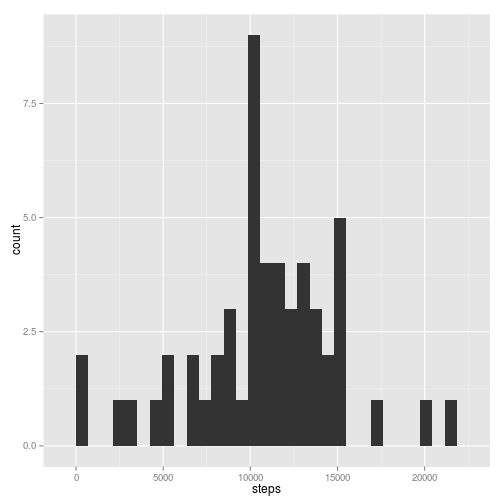
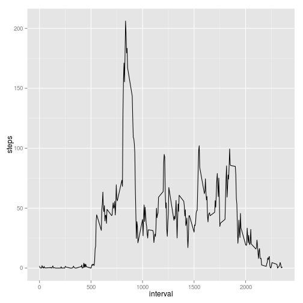
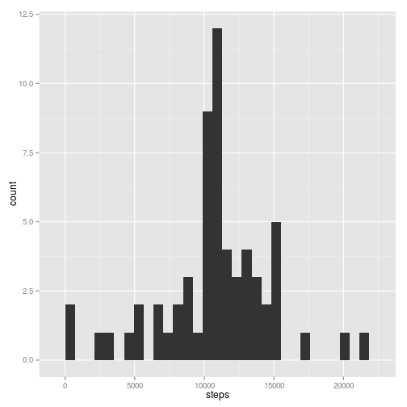
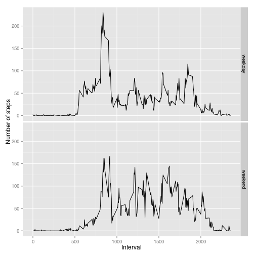

## Loading and preprocessing the data

*Load the data from the file "activity.csv" and then filter out rows for which
there is no step count.*


```r
stepData = read.csv("activity.csv")
stepData = stepData[!is.na(stepData$steps), ]
```

## What is mean total number of steps taken per day?

1. *Calculate the total number of steps taken per day.*


```r
stepsByDay = with(stepData, aggregate(steps, by=list(date), sum))
names(stepsByDay) = c("date", "steps")
```

2. *Make a histogram of the total number of steps taken each day.*


```r
library(ggplot2)
```

```
## Loading required package: methods
```

```r
ggplot(stepsByDay, aes(x=steps)) + geom_histogram()
```

 

3. *Calculate and report the mean and median of the total number of steps taken
   per day.*


```r
mean(stepsByDay$steps)
```

```
## [1] 10766.19
```

```r
median(stepsByDay$steps)
```

```
## [1] 10765
```

## What is the average daily activity pattern?

1. *Make a time series plot of the 5-minute interval (x-axis) and the average
   number of steps taken, averaged accross all days (y-axis).*


```r
stepsByInterval = with(stepData, aggregate(steps, by=list(interval), mean))
names(stepsByInterval) = c("interval", "steps")
library(ggplot2)
ggplot(stepsByInterval, aes(x=interval, y=steps)) + geom_line()
```

 

2. *Which 5-minute interval, on average across all the days in the dataset,
   contains the maximum number of steps?*


```r
stepsByInterval[which.max(stepsByInterval$steps), ]
```

```
##     interval    steps
## 104      835 206.1698
```

## Imputing missing values

1. *Calculate and report the total number of missing values in the dataset.*


```r
stepData = read.csv("activity.csv")
sum(is.na(stepData$steps))
```

```
## [1] 2304
```

2. *Devise a strategy for filling in all the missing values in the dataset.
   The strategy does not need to be sophisticated.  For example, you could use
   the mean/median for that day, or the mean for that 5-minute interval, etc.*


```r
# First compute the average by 5-minute interval.
stepsByInterval = with(stepData[!is.na(stepData$step), ],
    aggregate(steps, by=list(interval), mean))
names(stepsByInterval) = c("interval", "steps")

# Create a function that will return the steps (if not NA) or the interval average.
# This function will be used with 'mapply' to fill in NA values.
maybeStepsDefault = function (interval, steps) {
    if (!is.na(steps)) {
        return(steps);
    }
    # Return the interval steps average for this interval.
    stepsByInterval[stepsByInterval$interval == interval, "steps"][1]
}
```

3. *Create a new dataset that is equal to the original dataset but with the
   missing data filled in.*


```r
# Now swap out NA values with the interval average.
stepData$steps = mapply(maybeStepsDefault,
    interval=stepData$interval,
    steps=stepData$steps)
```

4. *Make a histogram of the total number of steps taken each day and calculate
   and report the mean and median total number of steps taken per day.  Do these
   values differ from the estimates from the first part of the assignment?  What
   is the impact of imputing missing data on the estimates of the total daily
   number of steps?*


```r
# First compute the total number of steps each day.
stepsByDay = with(stepData, aggregate(steps, by=list(date), sum))
names(stepsByDay) = c("date", "steps")

# Compute the mean and median number of steps each day.
mean(stepsByDay$steps)
```

```
## [1] 10766.19
```

```r
median(stepsByDay$steps)
```

```
## [1] 10766.19
```

```r
# Create a histogram of the total number of steps taken each day.
library(ggplot2)
ggplot(stepsByDay, aes(x=steps)) + geom_histogram()
```

 

*What is the impact of imputting missing data on the estimates of the total daily
number of steps?*

This change had very little effect.

## Are there differences in activity patterns between weekdays and weekends?

1. *Create a new factor variable in the dataset with two levels -- "weekday" and
   "weekend" indicating whether a given date is a weekday or a weekend day.*


```r
stepData$weekday = factor(
    weekdays(as.POSIXct(stepData$date)) %in% c("Saturday", "Sunday"),
    levels=c(FALSE, TRUE), labels=c("weekday", "weekend"))
```

2. *Make a panel plot containing a time series plot of the 5-minute interval
   (x-axis) and the average number of steps taken, averaged across all weekday
   days or weekend days (y-axis).  See the README in the GitHub repository to
   see an example of what this plot should look like using simulated data.*


```r
# Compute average number of steps by interval and weekday/weekend type.
stepsByInterval = with(stepData,
    aggregate(steps, by=list(interval, weekday), mean))
names(stepsByInterval) = c("interval", "weekday", "steps")

# Plot the average number of steps by interval, with a facet for weekends and weekdays.
library(ggplot2)
ggplot(stepsByInterval, aes(x=interval, y=steps)) + geom_line() + facet_grid(weekday ~ .)
```

 
